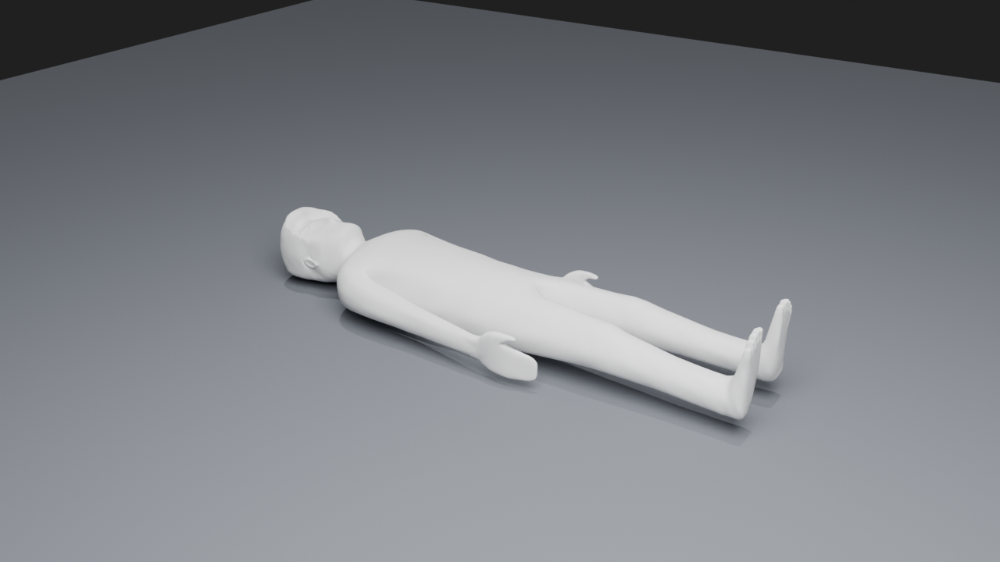

# supine-human-model

A simple, low-poly **human body mesh** prepared for use as a *patient figure* in
MRI / medical-imaging illustrations, scanner renderings, and simulation scenes.
The model is posed **arms down at the sides**, centred on the origin, and shipped
as a clean static `.glb` that drops straight into Blender, three.js, Unity,
Godot, or any glTF viewer.

It is derived from a **CC0 (public-domain) Quaternius** character, so you can use
it for anything — research figures, teaching, products — with no attribution
required (attribution is appreciated; see below).



*Smoothed (welded + subdivision-surface) mesh, scaled to 1.75 m and laid supine —
see [`human_supine.blend`](human_supine.blend).*

---

## Contents

| File | What it is |
|------|------------|
| `assets/human_posed.glb` | **The ready-to-use model.** Single static mesh, arms at sides, no rig/animation, centred on origin. |
| `assets/human.glb` | The original CC0 Quaternius source: rigged, skinned, with 8 walk/idle animations. Use this if you want to re-pose. |
| `human_supine.blend` | **Blender scene** with the smoothed mesh, scaled to 1.75 m, laid supine, lit, with camera + ground. Open this to see the model. |
| `build_blend.py` | Blender script that builds `human_supine.blend` from `human_posed.glb` (weld → smooth → subdivision → scale → lay supine → render). |
| `assets/human_supine_preview.png` | Rendered preview of the smoothed supine model (the figure above). |
| `prep_human.py` | Blender script that turns `human.glb` → `human_posed.glb` (bakes a pose, applies the scale, recentres). |
| `LICENSE` | CC0 1.0 (public domain dedication). |

---

## Model specs (`human_posed.glb`)

- **Topology:** one mesh (`Human_Mesh`), one material (`Texture`). Low-poly,
  smooth-shadeable; add a Subdivision-Surface modifier for a rounder look.
- **Rig:** none. The armature, skin and animations from the source are baked out,
  leaving a static mesh.
- **Orientation (glTF, +Y up):** body long axis runs along **Y**, head toward
  **+Y**, feet toward **−Y**; the figure faces **+Z**. Width is along **X**.
- **Origin:** at the bounding-box centre.
- **Raw dimensions (glTF units, *not* metres):** ≈ **1.05 (X) × 5.54 (Y) × 1.65 (Z)**.
  The model is **not** delivered at 1 unit = 1 m — scale it to your target
  height (see below).

### Dimensions of the supine model (`human_supine.blend`)

Scaled to a 1.75 m adult and laid on its back, the mesh measures (in metres):

| Axis | Extent | Meaning |
|------|--------|---------|
| Length (X) | **1.75 m** | head → foot (the "height" of the person) |
| Width (Y) | **0.52 m** | left → right, across shoulders with arms at sides |
| Thickness (Z) | **0.33 m** | back → front — i.e. how high the body sits off the table when supine |

(Subdivision-surface-evaluated extents: 1.75 × 0.52 × 0.32 m. The figure is
low-poly/stylised, so proportions are approximate, not anatomical.)

### Scaling to a real height (`human_posed.glb`)

The long axis (Y) is ≈ **5.54 units**. To get an adult of height *H* metres,
apply a uniform scale of `H / 5.54`:

| Target height | Uniform scale |
|---------------|---------------|
| 1.75 m | ≈ 0.316 |
| 1.80 m | ≈ 0.325 |
| 1.60 m | ≈ 0.289 |

(Set your scene units to metres first if your tool cares.)

---

## Quick start

**Blender**

```
File ▸ Import ▸ glTF 2.0 (.glb)  →  assets/human_posed.glb
```

Then scale uniformly (e.g. `S` `0.316` `Enter`) for a 1.75 m adult, and rotate
into your scanner's coordinate convention as needed.

**three.js / web**

```js
import { GLTFLoader } from 'three/addons/loaders/GLTFLoader.js';
new GLTFLoader().load('assets/human_posed.glb', (gltf) => {
  gltf.scene.scale.setScalar(0.316);   // ~1.75 m
  scene.add(gltf.scene);
});
```

The `.glb` is self-contained (geometry + material embedded), so any standard
glTF importer in Unity, Godot, Babylon.js, Three, etc. will load it directly.

---

## Reproducing / re-posing

`prep_human.py` regenerates the posed mesh from the rigged source. It opens
`assets/human.glb`, clears the animation, swings the upper-arm bones down by
`--arm` degrees, bakes the pose into the mesh, applies the source's 69× node
scale, recentres the result, and exports `assets/human_posed.glb` (plus a
preview render).

Requires [Blender](https://www.blender.org/) (tested with 5.x; run from this
folder):

```
blender -b -P prep_human.py -- --arm 78
```

Increase/decrease `--arm` to bring the arms tighter to the body or out further.

---

## Source & license

- **Source model:** a CC0 character by **Quaternius** — <https://quaternius.com>.
- **License:** released into the public domain under
  [Creative Commons CC0 1.0](https://creativecommons.org/publicdomain/zero/1.0/).
  This repository (the posed mesh, scripts, and docs) is likewise distributed
  under **CC0 1.0** — see [`LICENSE`](LICENSE).

You may copy, modify, distribute, and use the model — including commercially —
without asking permission. No attribution is legally required. As a courtesy,
crediting **Quaternius** (original model) and **UMRAM, Bilkent University**
(this prepared/posed version) is welcome.
